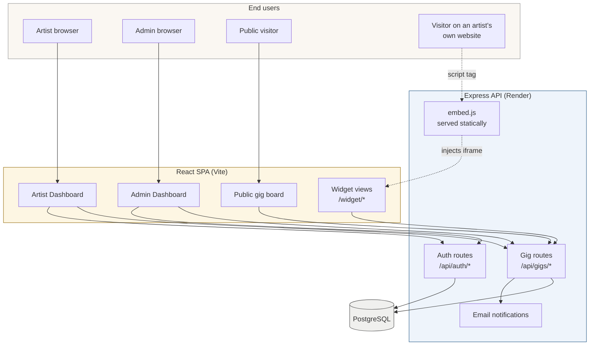
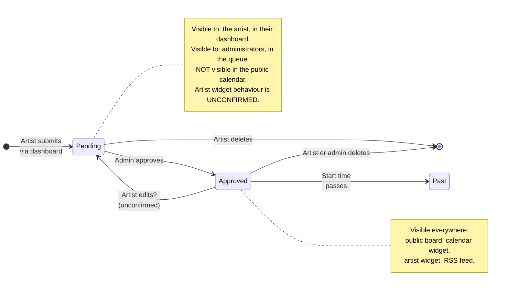
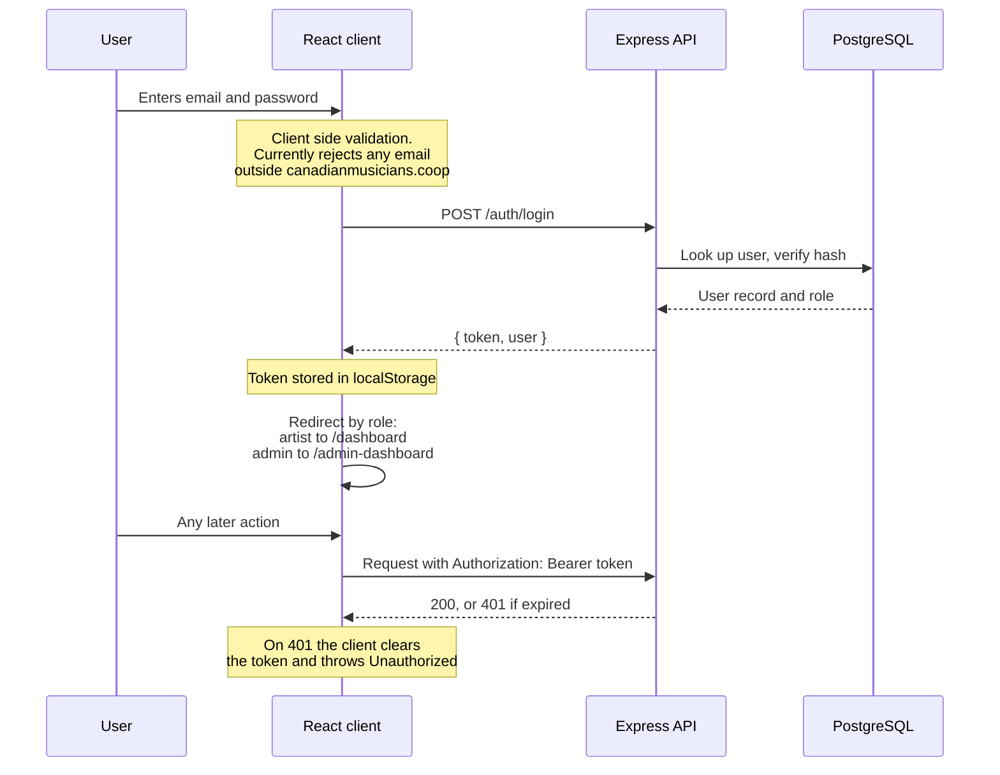
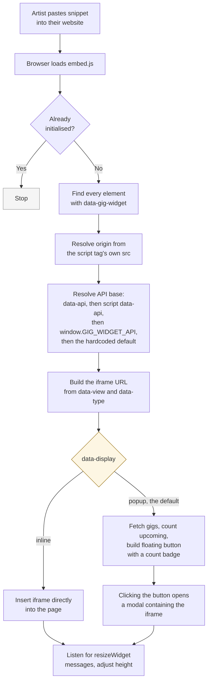

# GigBoard

**Artist gig management and embeddable widgets for the Canadian Musicians Co-operative.**

Member artists post their upcoming shows. An administrator approves them. Approved gigs then appear on the Co-operative calendar and on each artist's own website through a small embeddable widget.

> [!IMPORTANT]
> This README documents the system as it currently stands. Several items marked **NEEDS VERIFICATION** could not be confirmed without reviewing the server code, and several marked **KNOWN ISSUE** describe behaviour that is broken today. Both are called out inline rather than quietly omitted, because a README that hides them is worse than no README at all.

---

## Table of contents

1. [What this is](#1-what-this-is)
2. [How it fits together](#2-how-it-fits-together)
3. [Repository layout](#3-repository-layout)
4. [Getting it running locally](#4-getting-it-running-locally)
5. [Environment variables](#5-environment-variables)
6. [The gig lifecycle](#6-the-gig-lifecycle)
7. [Authentication and roles](#7-authentication-and-roles)
8. [API surface](#8-api-surface)
9. [Frontend routes](#9-frontend-routes)
10. [The embed widget](#10-the-embed-widget)
11. [Deployment](#11-deployment)
12. [Known issues](#12-known-issues)
13. [Open questions](#13-open-questions)

---

## 1. What this is

GigBoard has three audiences, and almost every design decision in the codebase traces back to one of them.

| Audience | What they do | Where they do it |
| :--- | :--- | :--- |
| **Member artist** | Creates and edits their own gigs, grabs a widget snippet for their website | `/dashboard` |
| **Administrator** | Reviews pending gigs and approves them | `/admin-dashboard` |
| **The public** | Browses the Co-operative gig listing, or sees an artist's gigs on that artist's own site | `/global`, or an embedded widget on a third party site |

The third audience is the one that matters most and is the easiest to overlook. A visitor to an artist's website never touches GigBoard directly. They load someone's Squarespace page, a script tag pulls in `embed.js`, and a widget appears. That entire path has to work without anyone technical present.

---

## 2. How it fits together



Three things are worth internalising before you read any code.

**The widget is an iframe, not a component.** `embed.js` does not render gigs itself. It builds a URL pointing at a widget route on the frontend and drops an iframe there. That iframe is a full React page. This keeps third party websites from having to load React, and keeps their CSS from wrecking our layout.

**The iframe talks to the API directly.** The widget page reads an `api` query parameter out of its own URL and uses that as its base URL. See `client/src/api.js`, top of file. This is why the same widget build works against local and production servers.

**The iframe reports its own height back to the parent.** The widget page posts a `resizeWidget` message upward, and `embed.js` resizes the iframe to match. Without this, inline widgets would be stuck at a fixed 600 pixels.

---

## 3. Repository layout

```
artist-gig-widget/
├── client/                      React frontend (Vite)
│   ├── public/
│   │   └── embed.js             The script third party sites load. Ships as-is, unbundled.
│   ├── src/
│   │   ├── api.js               Single source of truth for all API calls
│   │   ├── api/                 DEAD CODE, see Known Issues
│   │   ├── App.jsx              Route map and navigation
│   │   ├── main.jsx             Entry point
│   │   ├── components/          All pages and widgets
│   │   ├── context/
│   │   │   └── AuthContext.jsx  Token storage, current user, login and logout
│   │   ├── assets/
│   │   └── styles/
│   ├── .env.development
│   └── vite.config.js
│
└── server/                      Express API
    ├── src/                     Routes, controllers, database access
    ├── sql/                     Schema and migrations
    ├── public/
    ├── .env.development
    └── .env.production          MUST NOT BE HERE, see Known Issues
```

> [!WARNING]
> `node_modules/` and `dist/` are currently committed to this repository, as are several `.DS_Store` files and both `.env` files. None of these belong in version control. See [Known issues](#12-known-issues).

---

## 4. Getting it running locally

### Prerequisites

- Node.js 18 or newer
- PostgreSQL running locally
- One package manager, chosen deliberately. **NEEDS VERIFICATION:** the client folder currently contains both `package-lock.json` and `pnpm-lock.yaml`. Confirm which one the deployment actually uses before you install anything, and delete the other.

### Steps

```bash
# 1. Clone
git clone <repo-url>
cd artist-gig-widget

# 2. Database
createdb gigboard
psql gigboard -f server/sql/<schema-file>.sql   # confirm the filename in server/sql/

# 3. Server
cd server
npm install
cp .env.example .env.development     # then fill in real values
npm run dev                          # confirm the script name in package.json

# 4. Client, in a second terminal
cd ../client
npm install
npm run dev
```

The client expects the API on port 4000 by default. If you change that, change `VITE_API_URL` too.

### Verifying it works

Work through this in order. Each step depends on the one above it, so the first failure tells you where the problem is.

1. Open the client. You should land on the sign in screen.
2. Register an artist account, then sign in. You should land on `/dashboard`.
3. Create a gig. It should appear in your dashboard, marked unapproved.
4. Sign in as an administrator and approve it. **NEEDS VERIFICATION:** confirm how an account is promoted to administrator. It is most likely a direct database update.
5. Open `/global`. The gig should now be listed.
6. Open `client/dist/index.html` or a scratch HTML file, paste in an embed snippet, and confirm the widget renders.

---

## 5. Environment variables

### Client (`client/.env.development`)

| Variable | Purpose | Local value |
| :--- | :--- | :--- |
| `VITE_API_URL` | Base URL for all API calls, including the `/api` suffix | `http://localhost:4000/api` |
| `VITE_WIDGET_ORIGIN` | Origin used when building widget iframe URLs | `http://localhost:4000` |

Note that `VITE_API_URL` is only a fallback. `client/src/api.js` resolves its base URL in this order:

1. The `api` query parameter on the current URL. This is how a widget iframe is told where to talk.
2. `window.GIG_WIDGET_API`, if a host page has set it.
3. `VITE_API_URL` from the build.

### Server (`server/.env.production` and `server/.env.development`)

**NEEDS VERIFICATION.** Not yet reviewed. Based on observed behaviour the server requires, at minimum, a PostgreSQL connection string, a JWT signing secret, mail credentials, and a frontend origin for CORS and for building password reset links.

> [!CAUTION]
> Both server `.env` files are committed to the repository. Treat every credential inside them as exposed. Rotate them, remove the files from version control, and replace them with a `.env.example` that lists variable names and no values.

---

## 6. The gig lifecycle

A gig has exactly two states today: approved, and not approved. "Pending" is the informal name for the second one. There is no separate rejected state.



### Who sees what

| Surface | Shows pending gigs? | Endpoint |
| :--- | :--- | :--- |
| Artist dashboard | Yes, with status shown | `GET /gigs/mine` |
| Admin dashboard | Yes, that is the point | `GET /gigs/admin/gigs` |
| Public gig board | No | `GET /gigs/public` |
| Calendar widget | No | `GET /gigs/calendar` |
| Artist widget | **UNCONFIRMED** | `GET /gigs/user/:id` |

> [!WARNING]
> That last row is the most important unresolved question in this codebase. `GET /gigs/user/:id` is called from `embed.js`, which runs on public third party websites, with no authentication. If it returns unapproved gigs, the approval gate is decorative. Confirm the server side filter on this endpoint and, if it is missing, add it at the query level rather than in the browser.

### Filtering by time

Upcoming versus past is computed from `date_time` against the current moment, and it is computed in more than one place. `embed.js` does it client side when counting gigs for the notification badge. The dashboard and browse pages have their own filters.

**NEEDS VERIFICATION:** whether `date_time` is stored with a time zone. Canada spans six of them. If the column is a naive timestamp, this needs addressing before more listings accumulate.

---

## 7. Authentication and roles



### Roles

Two roles: `artist` and `admin`. Route protection lives in `App.jsx` and is purely client side, which means it controls what the user sees, not what they can do. Actual enforcement must happen on the server for every endpoint.

> [!WARNING]
> **Field name mismatch.** `Login.jsx` reads the role from `res.user.user_role`. `App.jsx` reads it from `user?.role`. Unless `AuthContext.jsx` normalises between the two, `user.role` will be `undefined` and no user will ever be recognised as an administrator. The admin route then redirects to `/admin/login`, which does not exist in the route map, which falls through to the catch all and back to sign in. Verify `AuthContext.jsx` and settle on one field name everywhere.

### Token storage

The JWT lives in `localStorage` and is attached as a bearer token by `apiFetch` in `client/src/api.js`. This is a deliberate and common trade off: it is simple and survives page reloads, but any script running on the page can read it. An httpOnly cookie would not have that weakness, at the cost of more setup around CSRF and cross origin requests. Recorded here so the choice is visible rather than accidental.

Signing out clears the token client side and redirects. There is no server side invalidation, so a copied token remains valid until it expires.

---

## 8. API surface

Every call goes through `apiFetch` in `client/src/api.js`, which attaches the bearer token, sets the JSON content type, and converts non-2xx responses into thrown errors. The one exception is `embed.js`, which calls `fetch` directly because it runs outside the React app.

All paths below are relative to the API base, which already includes `/api`.

### Auth

| Method | Path | Purpose |
| :--- | :--- | :--- |
| `POST` | `/auth/register` | Create an artist account |
| `POST` | `/auth/login` | Returns `{ token, user }` |
| `GET` | `/auth/me` | Current user from the bearer token |
| `POST` | `/auth/forgot-password` | Sends a reset email |
| `POST` | `/auth/reset-password` | Consumes `{ password, resetToken }` |

### Gigs

| Method | Path | Auth | Purpose |
| :--- | :--- | :--- | :--- |
| `GET` | `/gigs` | ? | `fetchAllGigs` |
| `GET` | `/gigs/all` | ? | `fetchGigs` |
| `GET` | `/gigs/mine` | Artist | Gigs owned by the caller |
| `GET` | `/gigs/public` | None | Approved gigs, public board and global widget |
| `GET` | `/gigs/calendar` | None | Approved gigs for the calendar widget |
| `GET` | `/gigs/user/:id` | None | One artist's gigs, used by the artist widget |
| `GET` | `/gigs/admin/gigs` | Admin | The approval queue |
| `POST` | `/gigs` | Artist | Create |
| `PUT` | `/gigs/:id` | Artist or admin | Update, including approval |
| `DELETE` | `/gigs/:id` | Artist or admin | Delete |

### Artists

| Method | Path | Purpose |
| :--- | :--- | :--- |
| `GET` | `/artists/:id` | Artist profile, name and website |

> [!NOTE]
> `fetchAllGigs` maps to `/gigs` and `fetchGigs` maps to `/gigs/all`. The names read as though they are the other way around. Both appear to exist. Determine what each actually returns, delete whichever is redundant, and rename the survivor to something that describes it.

**NEEDS VERIFICATION** for this whole section: the auth requirement on each endpoint, the exact response shapes, and an RSS feed route which commit history suggests exists but which nothing in the client calls.

---

## 9. Frontend routes

Defined in `client/src/App.jsx`.

| Path | Component | Access |
| :--- | :--- | :--- |
| `/` | redirect | Sends everyone to `/login` |
| `/login` | `Login` | Redirects signed in users to their dashboard |
| `/register` | `Register` | Public |
| `/forgot-password/` | `ForgotPassword` | Public |
| `/reset-password/` | `ResetPassword` | Public, expects a token |
| `/global` | `GlobalWidget` | Public |
| `/artist/:artistId` | `ArtistWidget` | Public |
| `/dashboard` | `Dashboard` | Artist |
| `/admin-dashboard` | `AdminDashboard` | Admin |
| `*` | redirect | Sends everyone to `/login` |

Two problems are visible in that table.

The root path redirects to sign in, and so does every unrecognised path. A visitor arriving at the site with no account is shown a locked door. For a product whose stated purpose includes a public gig listing, the landing page should be `/global`.

The admin route redirects unauthorised users to `/admin/login`, which is not in this table because it does not exist.

### The widget routes

`embed.js` builds iframe URLs pointing at `/widget/calendar`, `/widget/artist` and `/widget/global`. **None of these appear in `App.jsx`.**

The most likely explanation is that the server serves a separate widget build at those paths. The presence of `server/public/`, and a `dist/index.html` titled "Gig Widgets" that loads a different bundle, both support this. But it is unconfirmed, and if it is wrong then every widget in production is broken. This is the first thing to check when reviewing the server.

---

## 10. The embed widget

This is the artist facing surface and the one most likely to generate support requests. It is a single unbundled file, `client/public/embed.js`, deliberately kept free of build steps so it can be dropped onto any website.

### How a snippet becomes a widget



### Attributes

Set on the `div`. Every one of them is optional except where noted.

| Attribute | Values | Default | Notes |
| :--- | :--- | :--- | :--- |
| `data-gig-widget` | present | required | Marks the element. No value needed. |
| `data-type` | `artist`, `public` | `public` | `artist` shows one artist. `public` shows everyone. |
| `data-user-id` | numeric id | none | **Required when `data-type="artist"`.** Without it the widget logs an error and renders nothing. |
| `data-view` | `card`, `list`, `calendar` | `card` | `calendar` overrides `data-type` entirely. |
| `data-display` | `inline`, `popup` | `popup` | `inline` embeds in the page flow. `popup` gives a floating button and modal. |
| `data-api` | URL | production API | Override. Also settable on the script tag. |

> [!CAUTION]
> **`data-artist-id` is not a real attribute.** The Floating Bubble snippet currently shown on the artist dashboard uses it. `embed.js` never reads it. That snippet is broken and must be corrected to `data-user-id`. This is the single highest impact bug in the repository, because the people who hit it are the least equipped to diagnose it.

### Correct snippets

Floating button, for one artist:

```html
<div data-gig-widget data-type="artist" data-user-id="5" data-view="list"></div>
<script src="https://artist-gig-widget-server.onrender.com/embed.js"></script>
```

Inline list, for one artist:

```html
<div data-gig-widget data-type="artist" data-user-id="5" data-view="list" data-display="inline"></div>
<script src="https://artist-gig-widget-server.onrender.com/embed.js"></script>
```

Inline calendar, all approved gigs across the Co-operative:

```html
<div data-gig-widget data-view="calendar" data-display="inline"></div>
<script src="https://artist-gig-widget-server.onrender.com/embed.js"></script>
```

### Behaviour worth knowing about

**Origin resolution.** The iframe origin comes from the `src` of the script tag itself, not from `data-api`. So the script must be served from whichever origin also serves the widget routes. If those ever separate, this breaks in a way that is hard to trace.

**Double load protection.** `window.__GIG_WIDGET_INIT__` guards against the script being included twice. Note that it guards the whole script, not individual widgets, so a second script tag is ignored entirely.

**Popup mode fetches gigs twice.** Once in `embed.js` to compute the badge count, and again inside the iframe to render them. Acceptable, but worth knowing when reading network traces.

**Failures are silent.** Every error path in `embed.js` ends at `console.error`. A musician whose widget does not appear sees empty space and nothing else.

**Popup mode injects into `document.body`.** The floating button is fixed position at `z-index: 9998`, the modal at `9999`. Conflicts with a host site's own fixed elements are possible.

---

## 11. Deployment

**NEEDS VERIFICATION** throughout. This section is assembled from observed URLs and should be replaced with a real runbook.

| Component | Host | Notes |
| :--- | :--- | :--- |
| React client | Hostinger | Static build output |
| Express API | Render | `artist-gig-widget-server.onrender.com` |
| PostgreSQL | Unknown | **Confirm this, and confirm backups are running.** |
| `embed.js` | Served from the API origin | Must stay on the same origin as the widget routes |

Things that need answering and writing down:

- Which package manager the build uses, given there are two lock files
- Where each set of environment variables is configured
- Who holds access to each hosting account, and whether more than one person does
- Whether Render's free tier is in use. If so, the API sleeps when idle, and the first widget load after a quiet period will be slow enough that a visitor assumes it is broken.

---

## 12. Known issues

Listed roughly by severity. Each was found during review and none should be treated as intended behaviour.

### Critical

| # | Issue | Where |
| :--- | :--- | :--- |
| 1 | `.env.production` and `.env.development` are committed. Credentials must be treated as exposed and rotated. | `server/` |
| 2 | Sign in validation rejects every email outside `canadianmusicians.coop`, with the message "Email Format Invalid". If artists use their own addresses, none of them can sign in. | `Login.jsx` |
| 3 | The Floating Bubble snippet uses `data-artist-id`, which `embed.js` does not read. The snippet is dead. | Dashboard, `embed.js` |
| 4 | `handleForgotPW` contains `const res = // route to update password`, which swallows the following line. The function calls nothing and then reports success. | `Login.jsx` |
| 5 | `GET /gigs/user/:id` is unauthenticated and may return unapproved gigs to public websites. | Server, unverified |

### High

| # | Issue | Where |
| :--- | :--- | :--- |
| 6 | `user_role` versus `role` mismatch may lock administrators out entirely. | `Login.jsx`, `App.jsx`, `AuthContext.jsx` |
| 7 | `/admin-dashboard` redirects unauthorised users to `/admin/login`, which does not exist. | `App.jsx` |
| 8 | Root and catch all both redirect to sign in, so the public board has no reachable front door. | `App.jsx` |
| 9 | No rejected state and no rejection reason, so a declined gig is indistinguishable from an unreviewed one. | Schema |

### Medium

| # | Issue | Where |
| :--- | :--- | :--- |
| 10 | Browse page renders nothing at all when there are no results: no empty state, no loading state, no error state. | `GlobalWidget.jsx` |
| 11 | Filter buttons appear to show more than one active state simultaneously. | `GlobalWidget.jsx` |
| 12 | `node_modules/`, `dist/` and `.DS_Store` are committed. | Both folders |
| 13 | Two lock files, `package-lock.json` and `pnpm-lock.yaml`. | `client/` |
| 14 | `src/api/` imports `{ api }` from `../api.js`, which exports `apiFetch`. Dead on import and unused. Delete it. | `client/src/api/` |
| 15 | `fetchAllGigs` and `fetchGigs` have names that suggest the opposite of their paths. | `api.js` |
| 16 | Unused `forgotPW` and `forgotPWMessage` state left in the sign in component. | `Login.jsx` |
| 17 | No automated tests and no checks running before deployment. | Repository |

---

## 13. Open questions

Answer these and most of the uncertainty in this document disappears.

1. **Do the `/widget/*` routes exist, and where are they served from?** If the answer is unexpected, every production widget is affected.
2. **Does `GET /gigs/user/:id` filter to approved gigs?** This determines whether the approval gate is real.
3. **Is the email domain restriction intentional?** Determines whether item 2 is a bug or a policy.
4. **Does `AuthContext.jsx` normalise `user_role` to `role`?** Determines whether item 6 is a bug or a false alarm.
5. **How is an account promoted to administrator?** Needs documenting either way.
6. **Is `date_time` stored with a time zone?**
7. **Which package manager does the deployment use?**
8. **Where is the database, and are backups running and tested?**
9. **What is the RSS feed route, and is anything consuming it?**

---

## Contributing

Until the items in section 12 are addressed, prefer small focused changes over large ones. In particular, do not remove `node_modules/` and `dist/` from version control in the same commit as a feature change. That cleanup touches thousands of files and will make the feature impossible to review.

Before opening a pull request, confirm by hand that you have not broken: sign in for both roles, gig creation, gig approval, and at least one embedded widget on a scratch HTML page. There are no automated tests to catch you.
